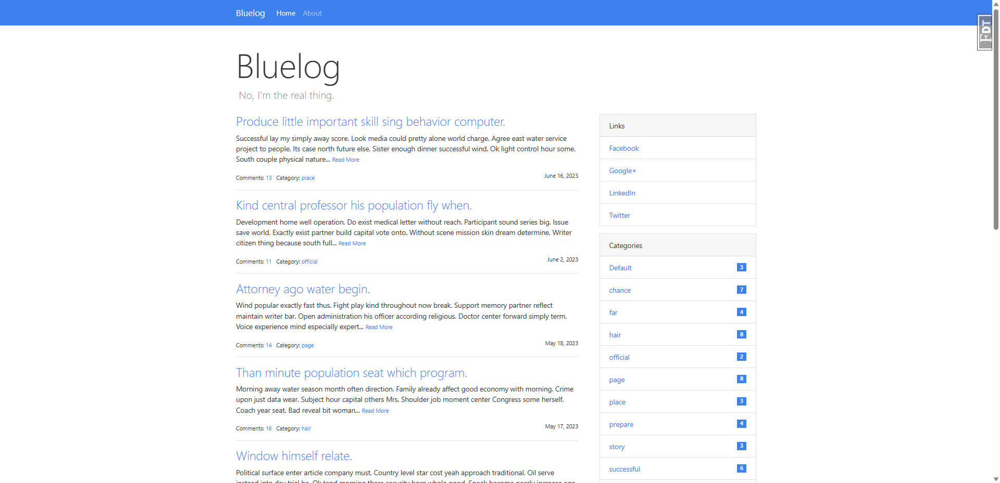

# Bluelog

*A blue blog.*

> 参考自： *[Python Web Development with Flask](https://helloflask.com/en/book/1)* (《[Flask Web 开发实战](https://helloflask.com/book/1)》).

演示地址: http://bluelog.helloflask.com



## 安装

clone:
```
$ git clone https://github.com/LuciferGSC/bluelog.git
$ cd bluelog
```
创建 & 激活虚拟环境然后安装依赖:

with venv/virtualenv + pip:
```
$ python -m venv env  # use `virtualenv env` for Python2, use `python3 ...` for Python3 on Linux & macOS
$ source env/bin/activate  # use `env\Scripts\activate` on Windows
$ pip install -r requirements.txt
```
or with Pipenv:
```
$ pipenv install --dev
$ pipenv shell
```


生成假数据并运行:
```
$ flask forge
$ flask run
* Running on http://127.0.0.1:5000/
```

测试账号:

* username: `admin`
* password: `helloflask`

附开发文档：
`docs/`

## License

This project is licensed under the MIT License (see the
[LICENSE](LICENSE) file for details).
